# GitHub Actions reporting — design

Status: **design, not yet implemented.** Reviewed by `product-vision` and `feature-quality`.

Scope: what `crates/plugin-gha` renders, and the event-stream changes that reporting needs.
Not in scope: the sticky-comment transport (found-or-create, per-step sections, run markers) —
that plumbing is sound and is kept.

---

## 1. The design constraint that drives everything: 20,000 targets

A real CI run has **20k targets**. Every number below is sized against that, not against the
120-target examples that make mockups readable.

At 20k targets:

| Quantity | Magnitude | Consequence |
|---|---|---|
| Events on the stream | ~160k (`~8/target`, measured — `crates/engine/src/engine/diag.rs:21`) | `on_event` must be allocation-light; nothing per-event may `format!` |
| Matched top-level set | up to 20k addrs | a full addr list is never renderable; every list is top-N |
| In-flight set (`running`) | **up to 20k**, not 16 — see §1.1 | the "slow" table must be filtered by *phase*, not just elapsed |
| Failure cone | up to ~20k rows from **one** broken leaf | per-target failure rows are unbounded; roots-only is mandatory |
| Packages | ~1–3k | package rollups are bounded and become the *primary* aggregation |
| Retained addr strings | ~16 MB today (§6) | current design retains the whole graph to answer questions about the matched subset |

**The rule this produces: no rendered section may be proportional to target count.** Every list is
top-N with an explicit overflow line, every aggregation is by package or by root, and the only
unbounded thing allowed to grow is a counter.

### 1.1 The in-flight set is not bounded by worker count

`RemoteCacheWriteStart` is emitted **before** the upload semaphore is acquired — deliberately, so a
queued push still renders as an in-flight `↑` op (`crates/engine/src/engine/remote_cache.rs:1643`).
`MAX_CONCURRENT_UPLOADS` is 16 (`remote_cache.rs:112`).

So on a 20k-target cold build, at the moment the build finishes executing, `running` can hold
**~20k `RemoteCacheWrite` entries of which 16 are actually uploading.** Today `Tally::slow()`
clones every entry past the 10s threshold into a `Vec<(String, _, _)>` and sorts it — on every
30-second render. That is ~20k `String` clones and an O(n log n) sort, producing a "slow targets"
table listing thousands of targets that are not slow, they are queued.

Requirements that follow:

- **Cap the slow scan.** Maintain a bounded top-N (N=20) by start time rather than scanning and
  sorting the whole map per render.
- **Distinguish queued from active.** A queued upload is not a slow target. Either the engine
  emits the slot acquisition (`RemoteCacheWriteQueued` → `…Start`), or the hook renders remote
  writes as one aggregate row (`↑ 1,412 uploads queued, 16 active`) and never as per-target rows.
  The aggregate row is preferred: it needs no event change and is the more useful fact.
- **Never render remote-cache-write rows in the live "longest running" table.** They are after the
  critical path and the user cannot act on them.

---

## 2. Two products, one event stream

The single biggest structural fault today is one `render_markdown` serving both surfaces.

| | **Live PR comment** | **Final step summary** |
|---|---|---|
| Read by | a human, on a phone, ~3s, repeatedly | someone debugging a red build; an agent deciding what's next |
| Question answered | *pass? stuck? how long? is it mine?* | *what broke and why, how long, what did cache do* |
| Shape | ≤8 lines, failures first, ≤3-column tables | tables, log tails, one diagram |
| Budget | 65,536 chars, **shared with every other step's section** | 1 MiB |
| Cost per render | one authenticated API write | one file write, free |
| Diagrams | **never** (mermaid does not render in the GitHub mobile app) | yes, one |
| Cadence | timer + out-of-band on failure | once |

`render_live()` and `render_final()` are separate functions with separate budgets. The final view
is not "the live view at t=end" — that is why today's summary ships a "slow targets" table that is
structurally near-empty, since it reports *currently-running* targets at the moment everything has
finished.

---

## 3. What the hook throws away today

`Tally::apply` has a `_ => {}` arm (`crates/plugin-gha/src/lib.rs:142`). Silently dropped:

- `MaxWorkers` — worker saturation, the "is it stuck vs busy" signal
- `ResultLockWaitStart { holder_pid }` / `End` — the other half of that signal
- `LocalCacheMiss`, `RemoteCacheMiss` — the entire denominator of the hit rate
- `ResultStart` — per-target start time
- `GcTargetSwept`

And every `at_unix_ms` on every event, so **no duration of any kind survives**. The TUI
(`crates/tui/src/tui/progress.rs`) consumes all of it. The CI reader — who has *less* context than
the terminal user, not more — currently gets strictly less information.

**Requirement: `Tally::apply` matches exhaustively**, with an explicit no-op arm and a one-line
reason for each ignored kind, so a new `BuildEventKind` is a compile error here rather than a
silent drop.

---

## 4. Live view

### 4.1 Healthy, 20k targets

```markdown
## ⏳ heph run //... · 6m12s

**8,412 / 20,140** done · 7,901 cached · **0 failed**
`████████░░░░░░░░░░░░` 42% · 64/64 workers busy · updated 14:02:11Z

<details><summary>Running longest (6 of 218 over 30s)</summary>

| target | phase | for |
| --- | --- | --- |
| `//services/api:image` | execute | 4m02s |
| `//web:bundle` | execute | 3m48s |
| `//go/pkg/db:test` | execute | 2m11s |
| `//services/auth:image` | execute | 1m52s |
| `//tools/proto:gen` | execute | 1m40s |
| `//web:typecheck` | execute | 1m31s |

</details>
```

Notes at scale:

- `6 of 218 over 30s` — the count is the honest signal; the rows are the sample. Never list 218.
- `64/64 workers busy` distinguishes *slow* from *wedged*, and is free (`MaxWorkers` + the
  in-flight count).
- `updated …Z` is load-bearing: without it a ⏳ comment is indistinguishable from a comment whose
  runner was OOM-killed 20 minutes ago.
- The threshold is `slowAfterSecs`, default **30** (today's hardcoded 10s lists half a cold build).

### 4.2 Stuck

```markdown
## ⏳ heph run //... · 14m40s — **no progress for 8m**

**8,412 / 20,140** done · 7,901 cached · 0 failed
`████████░░░░░░░░░░░░` 42% · **0/64 workers busy** · updated 14:09:37Z

> [!WARNING]
> 3 targets waiting on the result lock — another heph process holds it.

| target | phase | for |
| --- | --- | --- |
| `//services/api:image` | 🔒 locked (pid 4412) | 8m01s |
| `//web:bundle` | 🔒 locked (holder unknown) | 7m58s |
```

Every input here is already on the stream and discarded today. Idle workers plus a lock notice is
the difference between waiting and hitting cancel.

### 4.3 First failure — flushed out-of-band, comment reposted so it notifies

````markdown
## ❌ heph run //... · **1 failed** · still running (2m14s)

> [!CAUTION]
> **`//services/api:test` failed** — exit 1, after 34s.

```
--- FAIL: TestCreateUser (0.03s)
    user_test.go:88: want status 201, got 500
    user_test.go:91: body: {"error":"nil pointer"}
FAIL
```

Reproduce: `heph run //services/api:test`

---
8,412 / 20,140 done · 7,901 cached · 64/64 workers busy · updated 14:02:14Z
_Build continues — `--fail-fast` is off, remaining targets still running._
````

`updated 14:02:14Z` off the 30-second grid is the visible proof the out-of-band flush fired.

### 4.4 Cone expanding — the 20k case

One broken leaf can block ~20k targets. Rendering per-target rows is not an option.

````markdown
## ❌ heph run //... · **2 failed** (+4,117 blocked) · still running (7m02s)

> [!CAUTION]
> **2 root failures.** 4,117 targets blocked downstream.

### `//base:proto` — exit 1, after 3s

```
proto/api.proto:41:3: "UserId" is not defined.
```

Reproduce: `heph run //base:proto`
**4,109 targets blocked** — `//services` (2,204), `//web` (1,012), `//go/pkg` (893)

### `//web:lint` — exit 2, after 4s
`src/app.tsx:12:3  error  'foo' is defined but never used`
**8 targets blocked** — `//web` (8)

---
11,204 / 20,140 done · 7,901 cached · 61/64 workers busy · updated 14:07:02Z
````

Rules:

1. **A `ResultEnd` carrying `upstream_of: Some(root)` never renders a row.** It increments a
   counter attributed to its root, and a per-package tally under that root.
2. **Roots render in first-seen order, never re-sorted**, so consecutive PATCH bodies differ by
   appends only and an agent diffing two fetches sees "one new root", not a reshuffle.
3. **Log tail: 5 lines, first root only**, ~1 KiB cap. Mid-build the reader is answering "is this
   mine?" — one error answers that, ten don't.
4. Roots are themselves capped (10) with `…and N more root failures`.

Without rule 1, this same moment renders 4,117 rows of `dependency failed` and the actual proto
error is off the bottom of a phone screen.

### 4.5 Fail-fast mode

`--fail-fast` is opt-in (`src/commands/global.rs:67`), so keep-going is the default. When it *is*
on, a one-failure report reads as "one thing is broken" when the truth is "we stopped looking":

```markdown
> [!WARNING]
> Stopped at the first failure (`--fail-fast`) — 11,728 targets not attempted.
```

**The hook must never set or influence `fail_fast`.** A reporter that changes which targets execute
is the wrong shape; the same command with and without a `plugins:` entry must run the same targets.
Report the mode, don't set it.

### 4.6 Completion — collapse asymmetrically

- **Success** → one line. The PR timeline must not carry a green wall of tables forever.
  ```markdown
  ✅ **run //...** — 20,140 targets, 19,802 cached, 6m41s. [Full report](…#step-summary)
  ```
- **Failure** → stays expanded. It is the artifact people link in Slack.

---

## 5. Final view (step summary)

### 5.1 Success, all cached

```markdown
## ✅ heph run //... — 41s · 20,140/20,140 targets, nothing executed

20,140 cache hits (19,988 local, 152 remote) · 1.2 GiB pulled
```

### 5.2 Success, real work, 20k targets

````markdown
## ✅ heph run //... — 12m04s

| | |
| --- | --- |
| targets | 20,140 matched · 20,140 ok · 0 failed |
| cache | 19,802 hits (19,650 local, 152 remote) · **98.3% hit rate** · 338 misses |
| executed | 338 targets · 3h11m of execute time over 64 workers |
| remote cache | pulled 1.2 GiB (2m01s) · pushed 240 MiB (48s, 1,412 queued) |
| drivers | exec 201 · go 128 · sh 9 |

<details><summary>Slowest 20 of 338 executed</summary>

| target | driver | execute | cache write | total |
| --- | --- | --- | --- | --- |
| `//services/api:image` | exec | 4m12s | 4s | 4m16s |
| `//web:bundle` | exec | 3m48s | 2s | 3m50s |

</details>

<details><summary>Cache misses by package (338 across 47 packages)</summary>

| package | misses | executed |
| --- | --- | --- |
| `//services/api` | 94 | 41m12s |
| `//web` | 71 | 22m18s |

_…and 45 more packages._

</details>

<details><summary>Timeline — 12m04s, 64 workers, showing the 20 longest of 338 executed</summary>

> The last **4m02s** was `//services/api:image` running alone — it is the long pole.

```mermaid
gantt
    title Run timeline
    dateFormat x
    axisFormat %M:%S
    todayMarker off

    section run
    matching       :0, 31000
    executing      :31000, 692000
    cache upload   :692000, 724000

    section longest targets
    services/api·image :440000, 692000
    web·bundle         :210000, 438000
    go/pkg/db·test     :120000, 305000
```



</details>
````

At 20k the **package rollup is the primary aggregation** — a per-target list of 338 misses is
already unreadable, and the interesting fact ("the misses are concentrated in two packages") only
exists at the package level.

### 5.3 Failure

````markdown
## ❌ heph run //... — 2 of 20,140 targets failed in 7m48s

> [!CAUTION]
> **2 root failures**, 4,117 targets blocked downstream. 15,921 ok.

### `//base:proto`
`exec` · executed 3s · exit status 1

```
proto/api.proto:41:3: "UserId" is not defined.
proto/api.proto:52:3: "UserId" is not defined.
```

Reproduce: `heph run //base:proto`

**4,109 targets blocked downstream** — `//services` (2,204), `//web` (1,012), `//go/pkg` (893)

### `//web:lint`
`exec` · executed 4s · exit status 2

```
src/app.tsx:12:3  error  'foo' is defined but never used
```

Reproduce: `heph run //web:lint`

---
15,921 ok · 15,802 cached · [full log](https://github.com/o/r/actions/runs/123456)
````

### 5.4 Frozen-check failure

`FrozenCheckError` carries its diff as structured data (`crates/plugin/src/error.rs:273`;
`src/commands/errors.rs:121` already renders it in a dedicated box). A ```` ```diff ```` fence gets
GitHub's `+`/`-` colouring free, on a failure mode that is *entirely* about reading a diff.

````markdown
### `//proto:gen`
`exec` · frozen check failed — generated output differs from tree

```diff
--- proto/api.pb.go (tree)
+++ proto/api.pb.go (generated)
@@ -41,6 +41,7 @@
 type User struct {
   Id    string
+  Email string
 }
```

Reproduce: `heph run //proto:gen` (without `--frozen`)
````

### 5.5 Zero cache hits — the diagnosability case

Today no heph surface can answer "why did I miss", because `LocalCacheMiss { addr }` is a bare
addr. With §7's `MissReason`:

```markdown
## ✅ heph run //... — 47m21s · **0 of 20,140 targets hit cache**

> [!WARNING]
> **19,984 misses were `definition changed`** — a BUILD file or tool version in the dependency
> closure differs from the last cached run. 156 were `never built here`.
> Remote cache: configured (`s3://ci-cache`), reachable, 0 hits, 19,984 misses.
>
> Inspect one: `heph inspect hashin //services/api:test`
```

The three things that make this work, all design-time:

1. Miss reasons are **counted and the dominant one named in prose**, not tabulated.
2. The remote cache states whether it was **configured and reachable** — "0 remote hits" is
   otherwise ambiguous between "no remote cache" and "the remote cache is broken", and those page
   different people.
3. **The next command is printed.** `heph inspect hashin` already exists; extend the surface the
   user has rather than inventing an `--explain` nobody discovers.

---

## 6. Data structures and cost at 20k

### 6.1 What it costs today

`Tally` holds `matched`, `finished`, `cache_hit` as `BTreeSet<String>` and `failed` as an unbounded
`Vec`. `finished` and `cache_hit` accumulate over the **whole graph** but are only ever read as
`matched ∩ …` (`lib.rs:148-162`).

At ~80-100 B per retained addr, a 100k-target graph with 10k matched retains ~16 MB of which ~90%
is never read. At 20k targets it is ~3-4 MB, still mostly dead. `BTreeSet<String>` also costs
O(log n) **string comparisons** per insert, each walking a long shared `//deep/package/...` prefix
before diverging.

### 6.2 Target design

One record per target, dropped at `ResultEnd`; counters folded at both edges (the rule the TUI
already adopted at `progress.rs:668-676` after measuring 21–24 ms per frame of rescans at 100k):

```rust
struct TargetRec {
    started_ms: u64,
    phase: Option<(Phase, u64)>,
    driver: Option<Box<str>>,
    cache: Option<CacheHitKind>,   // Local | Remote — needed to un-count on retraction
}

struct Tally {
    live: FxHashMap<Box<str>, TargetRec>,   // in-flight only; dropped at ResultEnd
    seen: FxHashSet<u64>,                    // addr hashes, 8 B, for late-Matched dedup
    slowest: BoundedHeap<Completed, 20>,     // top-N by duration, ~6 KB constant
    roots: Vec<RootFailure>,                 // capped at 10 rendered, counted beyond
    by_package: FxHashMap<Box<str>, PkgTally>,
    counters: Counters,                      // executed, cached_local, cached_remote, misses…
}
```

Result: **~5 MB at 100k targets, less than the ~16 MB today, with strictly more output.**

Allocation: the addr `String` is already allocated by the plugin seam's JSON decode
(`crates/plugin-sdk/src/serve.rs:1404`) — the hook cannot avoid that. But the hook's *own*
3–4 clones per target (`matched`, `finished`, `cache_hit`, `running`) collapse to **one**
`Box<str>` on first sight; every later event is a lookup and a field write. At 20k targets that is
~80k → ~20k allocations.

**Package-key rule:** derive as `&addr[..addr.rfind(':')]`, `get_mut` first, `insert(pkg.to_string())`
only on miss. Otherwise a package `String` is allocated on every one of the ~160k events.

### 6.3 Cost verdict per feature

| Feature | Verdict | Note |
|---|---|---|
| Total build time | cheap | fold `min`/`max` of `at_unix_ms`. Call it "build time" — the first event is not process start |
| Driver mix | cheap | `ExecuteStart.driver`; ≤20 entries |
| Hit rate, local vs remote | cheap | misses are free today (dropped); needs `CacheHitKind` to un-count on retraction |
| Lock waits, worker saturation | cheap | bounded by concurrency |
| Package rollups | cheap | bounded by ~1–3k packages; obeys the key rule above |
| Top-N slowest completed | cheap | bounded heap, ~6 KB |
| **Per-target duration map** | **needs a cap** | ~118 B/target retained forever → ~2.4 MB at 20k, ~12 MB at 100k. Use the heap, never a map |
| **Critical path** | **don't build** | `BuildEventKind` carries no dependency edges. Adding them multiplies per-event JSON by fan-out for *every* hook. Ship "top-N slowest" and name it that |
| Previous-run delta | cheap if capped | stash ≤512 B of JSON in a hidden marker; `fetch_existing` already returns the body and the code currently discards the prior run's content (`lib.rs:534`) |

Two things not to ship: a **critical path** without real edge data, and a **"cache saved 4m"**
number without recorded prior execute durations. Both are plausible-looking fabrications that
discredit every other number on the page.

---

## 7. Event-stream changes

Each must earn its place for the TUI and telemetry too, not only for this hook — the host
serde-JSON-encodes **every event per registered hook** at the emit chokepoint
(`crates/plugin-stabby/src/load_stable.rs:826`), so every added field is paid ~160k times.

### 7.1 `ResultEnd` carries structured failure detail — **the blocking change**

Today `error: Option<String>` is `format!("{e:#}")` (`crates/engine/src/engine/event.rs:64`) — the
whole anyhow chain on one line. `e.lines().next()` therefore yields the entire chain, unbounded in
width, and for the common case renders `execute //x:test: process exited with status 1`, which says
nothing.

**Approved shape — sibling fields, `error` untouched.** `compatibility` reviewed this and rejected
retyping `error` to a struct. Add fields alongside it instead:

```rust
ResultEnd {
    addr: String,
    error: Option<String>,                          // unchanged type AND semantics: still `{e:#}`
    #[serde(default)] upstream_of: Option<String>,  // collateral: this failed because `root` did
    #[serde(default)] exit_code: Option<i32>,
    #[serde(default)] log_tail: Option<LogTailData>,
}
```

`log_tail` attaches only to failing results, so a green 20k build pays nothing. `upstream_of` is
free — the engine constructs `UpstreamFailed { root }` at that exact site
(`crates/plugin/src/error.rs:195`).

### Why retyping `error` was rejected

`BuildEvent` is **already a live cross-process, cross-artifact boundary**, not the hypothetical one
the module doc implies. `StableRemoteHook` serde-JSON-encodes every event to out-of-process hooks
(`crates/plugin-stabby/src/load_stable.rs:826`), and `plugin-gha-cdylib` ships as its own release
artifact pinned by manifest URL independently of the `heph` binary — so host/plugin version skew is
a normal reachable state.

A skewed pair still loads at `dlopen` (stabby's structural check covers only the
`StreamItem { item: SVec<u8> }` envelope, which doesn't change). The break happens later, and the
failure mode is the worst available:

```rust
// crates/plugin-sdk/src/serve.rs
Body::StreamItem(si) => serde_json::from_slice(&si.item).ok(),   // decode failure -> None
...
match decode_event_frame(&bytes) {
    Some(ev) => hook.on_event(&ev),
    None => break,                                                // ends the WHOLE stream
}
}
hook.on_close();                                                  // hook thinks the build ended fine
```

**One undecodable frame silently truncates that hook's entire event stream**, and `on_close` then
fires as if the build had finished normally. No error surfaces anywhere. Worse, it is conditional
on a *failure* occurring — a green build with a skewed pair looks perfectly healthy, so it passes
every smoke test and breaks in the field on exactly the red builds this feature exists to diagnose.

The sibling shape is additive in both directions:

| | Result |
|---|---|
| old host → new plugin | keys absent; `#[serde(default)]` fills `None`; decodes fine, no richer detail |
| new host → old plugin | serde ignores unknown fields (no `deny_unknown_fields` on the enum); decodes fine, zero regression |
| matched | full detail |

`#[serde(default)]` is load-bearing, not decoration: a bare `Option<T>` field is **not**
absent-tolerant under `serde_derive` — a missing key is an error without it.

### Two constraints on the shape

- **`LogTail` cannot be used directly.** It lives in `crates/plugin/src/error.rs`, derives only
  `Debug, Clone, PartialEq, Eq` (no serde), and `crates/plugin` depends on `crates/core` — not the
  reverse. `hcore::events` is deliberately the lowest crate. So either define a small serde mirror
  in `hcore::events` (`text`, `start_line`) and convert at the emit site, or move the plain-data
  part of `LogTail` down into `hcore` and re-export it from `crates/plugin`.
- **The doc previously claimed telemetry reads this field.** It doesn't —
  `collector.rs::observe_event` only counts variant occurrences, it never inspects `.error`. The
  real exposure is the out-of-process hook seam above.

### Two follow-ups this surfaced (not part of the reporting work)

1. **`crates/core/src/events.rs` is in no ABI watch set.** `scripts/abi-check.sh` guards
   `crates/plugin-stabby/src/abi.rs` as a hard path and `proto/plugin/v1` as a warn-only glob;
   `events.rs` crosses the same dlopen'd seam and produces **zero** CI signal. Nothing forces a
   change here to be reviewed as a wire change, so this class of break will recur.
2. **Adding a `BuildEventKind` variant has the same failure characteristic.** The enum is
   `#[serde(tag = "type")]`; an old plugin meeting an unknown tag fails to decode and truncates its
   stream by the same path. A `#[serde(other)] Unknown` catch-all variant would make unknown kinds
   skippable rather than fatal. Pre-existing fragility, worth its own fix.

### 7.2 `MissReason` on cache-miss events + one-shot `CacheConfig`

```rust
LocalCacheMiss { addr: String, reason: MissReason }

enum MissReason { NoEntry, InputsChanged, DefChanged, BlobsMissing, Disabled }
```

Plus a one-shot `CacheConfig { local, remote: Vec<String>, read_only, forced_miss }` alongside
`MaxWorkers`. Coarse is fine — the point is turning a dead end into a direction.

### 7.3 Bytes on remote-cache span ends

`RemoteCacheReadEnd { addr, bytes, error }`, same for write. Two fields on events that already
exist, only on cache-touching targets.

### 7.4 Not now

- **`parent` on `ResultStart`** — the only honest basis for a critical path. Defer with the
  critical path itself.
- **Driver-emitted structured diagnostics** (`file`, `line`, `col`, `severity`). This is what
  unlocks `file=`/`line=` annotations and permalink embedding. It is a `Driver` surface change and
  belongs to its own design, not smuggled in here.

---

## 8. Reaching the developer

GitHub **does not notify on comment edits**, only on creation. A build that goes red at minute 2 of
40 silently updates a comment nobody is looking at. Two channels, different jobs:

### 8.1 Annotations — the live channel (MUST)

`::error::` workflow commands stream to the run page *while the job runs*, appear inline in the job
log at the point of failure, cost **zero API calls**, and are immune to rate limits. Nothing else in
Actions has all four properties.

```
::error title=heph //base:proto::exit 1: proto/api.proto:41:3: "UserId" is not defined.
```

**Target-level only in v1 — no `file=`/`line=`.** heph cannot produce them: `TargetFailure` carries
addr + log tail + cause chain and nothing else. Do **not** regex `file:line` out of the log tail in
the hook; that is a zoo of per-language heuristics living in a reporter, producing wrong
annotations on the PR diff. Gate `file=`/`line=` on §7.4's driver diagnostics.

**Cap annotations at the root count** (GitHub renders ~10 per step in the UI anyway). Never emit one
per collateral failure — at 20k that is 4,117 annotations.

### 8.2 Comment cadence and the repost

- Timer: `refreshSecs`, default 30.
- **Out-of-band flush on the first failure, then on each new *root* failure, floored at 10s.**
  Below the floor, set a dirty flag and let the next tick carry it. Collateral never flushes. Cost
  is bounded by *breakage count*, not target count.
- **On the running→failed transition, delete and re-post the comment once**, guarded by the
  existing `run_marker` so a re-run doesn't re-notify off stale state. Net comment count on the PR
  is unchanged; the state change generates exactly one notification; everything after is a PATCH.
- Suppress PATCHes whose *semantic* body is unchanged. Quantize the `updated` clock to 5s so this
  can actually fire.
- Honour `Retry-After`; back off the refresh interval as the build ages (15s → 30s → 60s).

Rate-limit context: GitHub's secondary limit on content-generating requests is ~80/min and ~500/hr
per token. 120 PATCHes/hr/step × 8 matrix legs × 3 heph steps = 2,880/hr → throttled, then a
`tracing::warn!` nobody reads and a comment that silently stops updating.

---

## 9. Byte budgets and truncation

**Today over 65,536 chars: GitHub 422s, `error_for_status` turns it into a warn (`lib.rs:579`), and
the comment freezes at its last good body for the rest of the job — every later tick 422s
identically.** It breaks exactly when the report matters most.

`MAX_FAILED_ROWS = 50` is a *row* count while each row's width is unbounded (see §7.1). 50 rows ×
~1.3 KB already exceeds the cap from a single step's section, and `assemble_body` concatenates
**every step's** section.

The bounded design:

1. **Budget in bytes, top-down.** `render_live(now, budget)` / `render_final(now, budget)`.
2. **Two budgets.** Summary ~900 KiB (headroom under 1 MiB). Comment = `65,536 −
   markers − other steps' sections`, computed at assemble time.
3. **Cap each row's width**, not just the count: `MAX_FAILURE_MSG = 200` chars on the message line.
4. Truncate at a `char_indices` boundary, never a byte index.
5. **`assemble_body` enforces the hard cap last**, dropping the oldest foreign sections with an
   explicit `…earlier steps trimmed` line. A comment that keeps updating beats one that is complete
   and frozen.
6. **Every truncation is visible** (`…and N more`, `…message truncated`). Silent truncation is the
   same class of bug as the silent 422.
7. **Treat a 422 as a bug signal, not a transient**: log the body length, then PATCH a minimal
   fallback body (header + counts) so the comment degrades to the essential numbers rather than
   freezing.

---

## 10. Visual vocabulary

### 10.1 The one diagram: a gantt, step summary only

Ship exactly one, in `$GITHUB_STEP_SUMMARY`, **never in the PR comment** — mermaid does not render
reliably in the GitHub mobile app, and the phone reader is the live view's entire justification.

A sorted duration table structurally cannot show what the gantt shows: **overlap** (338 targets
summing to 3h11m over 64 workers is either great or terrible), **the tail** (the last 4m02s was one
target alone — the most actionable CI perf fact there is), **idle gaps**, and **serialization**.

Rules:

- **Caps: 20 target rows + 4 phase rows.** Selected as the *longest*, and say so:
  `showing the 20 longest of 338 executed`.
- **Fallback is the sorted table**, which is built anyway. The diagram is **strictly additive** —
  never the sole source of any number.
- **Skip it entirely** under 3 executed targets or a 10s run.
- **Never ship a diagram whose finding isn't also stated in a sentence** above it. The diagram makes
  the finding credible; the sentence makes it reachable.

**The landmine: mermaid gantt uses `:` as its field separator, and every heph addr contains one.**
`//services/api:test` as a task label breaks the parse and renders as an error box. Sanitize —
strip `//`, replace `:` with `·`, strip any remaining `:`/`,`/`;` — and keep the real addr in the
adjacent table. This needs a specific test: a colon in a target name is not an edge case, it is
every target.

### 10.2 GFM features worth taking

| Feature | Use |
|---|---|
| `> [!CAUTION]` | failed. Coloured, icon'd, mobile-native, and still plain markdown so an agent parses it as a state marker |
| `> [!WARNING]` | stopped at first failure; 0 cache hits; lock waits |
| `> [!NOTE]` | informational only |
| `<details open>` | **first root failure only.** `open` on a long list defeats the phone case it serves |
| ```` ```diff ```` | frozen-check diffs (§5.4) — the one syntax-highlighted fence worth having |
| Plain fences | log tails. Highlighting mixed compiler/test output as `console` buys a coloured prompt character and invites language-guessing, which is the driver's job if it is anyone's |

Three alert levels is the whole vocabulary anyone can hold; leave `TIP`/`IMPORTANT` alone.

### 10.3 Rejected — and why, so it stays rejected

| Proposal | Why not |
|---|---|
| shields.io / any badge | External HTTP dep in a build report, camo-cached unpredictably, breaks on GHES and private repos, encodes one number a word already carries |
| Inline `<svg>` | Stripped by GitHub's sanitizer along with its whole subtree. SVG only works as a hosted ``, which needs an upload and a network dependency |
| Any ``, incl. a self-hosted chart renderer | Upload + network, camo-caches unpredictably, breaks on GHES/private, invisible to agents |
| Mermaid `pie` of cache hit rate | A two-slice pie is the textbook chart that loses to a percentage. `98.3% hit rate` is smaller, sharper, greppable |
| Mermaid flowchart of the failure cone | Star topology in the common case — one hub, N spokes — conveys exactly the fan-out count, which the sentence already gives. `heph inspect revdeps` owns this question |
| Mermaid dependency graph of the build | Unreadable above ~30 nodes; duplicates `heph inspect deps` badly |
| Any mermaid in the PR comment | Doesn't render in the mobile app; eats the 65,536-char budget |
| ASCII bar charts beyond the one progress bar | A per-package bar chart is a table that lost its alignment |
| Emoji beyond ⏳ ✅ ❌ | Those three encode state; 🐢🚀🔥 encode mood, and an agent must learn them for nothing |
| `#step:<n>:<line>` deep links | Three fragile lookups (jobs API, step index, log line) for a slightly better link. Link to the run |
| Nested collapsibles > 1 level | Two taps is one too many, and it breaks mermaid rendering in some clients |
| Live-view tables wider than 3 columns | Wrap into mush on a phone |

**The rule underneath:** a visual earns its place only when it makes a *finding* legible that prose
can't — and even then it ships alongside the sentence, never instead of it.

---

## 11. Agent-consumable surfaces

An autonomous agent reads this to decide what to do next. Markdown-scraping a table and getting one
line of a colon-joined chain serves it badly. Three surfaces, in priority order:

1. **`GITHUB_OUTPUT`** — GHA-native, free, no parsing, no rate limit:
   `heph_status=failed`, `heph_failed=2`, `heph_blocked=4117`, `heph_elapsed_ms=468000`,
   `heph_cache_hit_rate=0.983`, `heph_json_path=…`
2. **`jsonPath`** — a file the agent reads directly:

```json
{
  "schema": "heph.gha/1",
  "status": "failed",
  "command": "run //...",
  "elapsed_ms": 468000,
  "fail_fast": false,
  "targets": { "matched": 20140, "done": 15923, "failed": 2, "blocked": 4117,
               "cached": 15802, "executed": 338 },
  "cache": {
    "local_hits": 15650, "remote_hits": 152, "misses": 338, "hit_rate": 0.983,
    "miss_reasons": { "inputs_changed": 320, "no_entry": 18 },
    "remote": { "configured": true, "reachable": true, "endpoints": ["s3://ci-cache"],
                "bytes_pulled": 1288490188 }
  },
  "failures": [
    { "addr": "//base:proto", "driver": "exec", "duration_ms": 3000, "exit_code": 1,
      "upstream_of": null, "blocked_count": 4109,
      "message": "process exited with status 1",
      "log_tail": ["proto/api.proto:41:3: \"UserId\" is not defined."] }
  ],
  "slowest": [ { "addr": "//services/api:image", "driver": "exec", "duration_ms": 252000 } ]
}
```

3. **`<!-- heph:json {...} -->`** in the comment body, for an agent that fetches the comment via the
   API and has no filesystem access. The marker machinery already exists.

Stability rules: **field names never change within a schema version**; `failures` and `slowest` are
**deterministically sorted** (duration desc, then addr) so two runs diff cleanly; **collateral
failures never appear in `failures`** — they are `blocked_count` on their root.

### 11.1 The embedded JSON is a *different, hard-capped* document

The JSON above is the **file** form. It is unbounded by design — 338 `slowest` entries and full log
tails are fine in a file nothing limits.

**The embedded `<!-- heph:json -->` form must never be that document.** It lives inside a body that
GitHub caps at 65,536 characters (and, for the summary, 1 MiB) — a budget already shared with the
header, the failure boxes, and *every other step's section in the same job*. At 20k targets a naive
embed of the full document is tens of KiB on its own and would consume the entire comment.

Rules, all enforced in code and covered by tests:

1. **`EMBEDDED_JSON_MAX = 2048` bytes, hard.** The compact form carries counters, status, elapsed,
   cache summary, and **only the root failure addrs** — no log tails, no `slowest`, no
   `miss_reasons` breakdown, no package rollups.
2. **It is budgeted *first*, not last.** The embed is reserved out of the byte budget before any
   prose is rendered, because a truncated *fact* is recoverable for a human but a truncated *JSON
   document is unparseable* — a half-written object breaks the agent that depends on it.
3. **If the compact form still exceeds 2048 bytes** (many roots), drop root addrs oldest-first
   until it fits, and record what was dropped **inside the JSON** so the agent knows it is reading a
   truncated view:
   ```json
   {"schema":"heph.gha/1","status":"failed","truncated":true,"failures_omitted":37,
    "elapsed_ms":468000,"targets":{"matched":20140,"failed":41,"blocked":4117},
    "json_path":"/home/runner/work/_temp/heph-summary.json"}
   ```
4. **`truncated` and `json_path` are mandatory fields**, always present. `truncated: false` on the
   happy path. `json_path` is how an agent that hits a truncated embed finds the complete document —
   without it, truncation is a dead end.
5. **Serialize compactly** (no pretty-printing) and **never let a log tail, an error message, or an
   addr reach the embed unbounded** — addrs are capped at 128 chars each.
6. **The embed is emitted once, in the final render only.** Live PATCHes carry no JSON: it would
   burn budget on every tick to describe a state that is still changing, and an agent polling a
   running build should read `GITHUB_OUTPUT` or the file.

Test: at 20k targets with 200 root failures and 4 KB messages, assert the rendered body is
≤ 65,536 bytes, the embedded JSON **parses**, `truncated` is `true`, and `json_path` is present.

---

## 12. Config surface

Current: `refreshSecs`, `summaryPath`, `tokenEnv`. Keep the names and the camelCase.

| Option | Default | Why |
|---|---|---|
| `commentKey` | `$GITHUB_JOB` + leg discriminator | Fixes the matrix collision (§13) |
| `slowAfterSecs` | `30` | How long a target must run before it is surfaced as "running longest" |
| `jsonPath` | unset | The agent surface |
| `annotations` | `true` | `::error::` workflow commands |
| `detail` | `auto` | `compact`/`full`/`auto` (compact on success, full on failure) |
| `logTailLines` | follows the engine's `log_tail_lines` | Not a second independent number |

`summaryPath` keeps its name but changes semantics to **append**, matching GitHub's contract.

---

## 13. Inherited bugs — fix as the foundation

| # | Bug | Location |
|---|---|---|
| 1 | **Matrix legs collide.** `GITHUB_JOB` is the workflow-file job id, identical across legs. All legs race `fetch_existing`, all find nothing, all POST → duplicate comments; then each caches `sections` once at first sync and never re-reads, so legs permanently erase each other. This repo's own `test` job has three legs. **More urgent with §8.2's repost: a keying bug amplifies from clobbered sections to duplicate notifications** | `lib.rs:256`, `:663` |
| 2 | **`failed` counts the collateral cone and double-counts.** Unguarded `Vec` push; every dependent gets a `ResultEnd` carrying `dependency failed (root: …)`. One broken leaf under 20k dependents renders `failed: 20001`. The memoizer keys on `(addr, outputs, is_top)` so one addr can emit several `ResultEnd`s — the TUI guards with a set, this doesn't | `lib.rs:98-103` |
| 3 | **No byte budget** → silent 422 → the comment freezes (§9) | `lib.rs:231-248`, `:386-399` |
| 4 | **`executed` and `cached` have different denominators.** `built` increments on every `ExecuteEnd` graph-wide; `cached_count()` counts `matched ∩ cache_hit`. **Decision: graph-wide for both**, so the two are reconcilable | `lib.rs:116-121`, `:157-162` |
| 5 | **Step summary clobbered; failed write silent.** `fs::write` + `rename` destroys anything written earlier in the same step. `if write().is_ok() && let Err(e) = rename()` short-circuits, so a failed *write* logs nothing. Fixed temp path collides between concurrent processes | `lib.rs:606-617` |
| 6 | **Raw argv in a public comment** — any `--define`/`--env` carrying a secret is published. Unbounded length | `lib.rs:652` |
| 7 | **The live thread can overwrite the final comment.** It renders (releasing the tally lock) *before* taking the comment lock; if `on_close` lands in that window the stale "⏳" body PATCHes over the final one, permanently | `lib.rs:695-703`, `:724-739` |
| 8 | **No request deadline.** `fetch_existing` walks up to 10 pages at reqwest's 30s default; a first sync landing in `on_close` can block ~300s, and the host awaits `Hook::drain` before exit | `lib.rs:482-521` |
| 9 | **`parse_sections` mis-parses content containing its own delimiters**, and the section key is the unbounded raw command — a key containing `" -->"` appends a new section every step until the body hits the cap. Hash the key | `lib.rs:343-371` |
| 10 | **`_ => {}` drops six event kinds silently** (§3) | `lib.rs:142` |

---

## 14. Test plan

`crates/plugin-gha` `#[cfg(test)]` — everything below is provable in-process:

- **Byte-budget truncation at both limits**, adversarial: 500 failures × 4 KB single-line messages;
  3k packages; a 3 KB section key. Assert `body.len() <= 65_536`, the first root survives, and the
  truncation marker is present.
- **20k-scale folding**: 20k `Matched` + a 4k-deep collateral cone renders roots-only, `blocked`
  counts correctly, and no per-target row appears.
- **`CommentClient` against a loopback server** — needs the seam refactor below. Create-then-PATCH
  uses the returned id; adopt with matching run id preserves other steps' sections; different run
  id resets; 422 leaves state consistent; 404 mid-run doesn't wedge; `on_close` returns within its
  deadline against a server that never responds.
- **`write_summary`**: pre-existing content preserved; a failed write is logged; concurrent temp
  files don't collide.
- **Gantt label sanitization**: a target addr's `:` never reaches the mermaid block.
- **`parse_sections`** adversarial bodies: delimiters in content, `" -->"` in the key, newline in
  the key, empty body, container marker only.
- **Failure dedup**: a duplicate `ResultEnd` for one addr adds no row.
- **Out-of-band flush**: first failure flushes; a collateral failure does not; two roots within the
  10s floor coalesce.

**Blocking refactor: the HTTP layer has no test seam.** `from_env` reads process env directly
(`lib.rs:442`), so nothing can construct a `CommentClient` in a test without mutating global env.
Split `CommentClient::new(CommentConfig { … })` from a thin `from_env` adapter. Use the loopback
pattern already in `crates/e2e/tests/http_fetch.rs:17-41` (std `TcpListener` on `127.0.0.1:0`, no
new dependency).

**Test-isolation defect today:** `on_close_writes_final_summary_to_path` (`lib.rs:1109`) constructs
the real `GhaHook`, which calls `CommentClient::from_env`. Under Actions `GITHUB_REPOSITORY` and
`GITHUB_REF` are always set; only the absence of `GITHUB_TOKEN` from the `test` job's env stops it
spawning a live thread and POSTing onto the PR under test. That is an undeclared ambient invariant,
and it means the shipped branch (comment enabled) is the one never exercised.

`crates/e2e` — one test: run a real build with the hook registered and `summaryPath` in a
`TempDir`; assert the summary's counts match what the engine actually did, including a cache hit and
a failure. Every existing test hand-scripts the event stream and would keep passing if the engine's
event semantics changed.

`crates/bin-e2e` — **nothing new.** `shipped_gha_cdylib_loads` already covers the only qualifying
seam. Do not put summary-content assertions there.

---

## 15. Sequencing

1. **Rendering, keying, and the test seam — no engine changes.** Bugs 1, 3, 4, 5, 6, 7, 8, 9, 10;
   split `render_live`/`render_final`; elapsed + `updated …Z`; `executed` rename across both
   surfaces; byte budgets. This alone fixes the live
   view and every comment bug.
2. **`ResultEnd` structured failure detail** (§7.1) — gates live failure diagnosis, the highest-value
   item. Consult `compatibility` on the shape first.
3. **Annotations, out-of-band flush, the failure repost** (§8) — early diagnosis reaches a human.
4. **`MissReason` + `CacheConfig`** (§7.2), the prose diagnosis, `jsonPath` / `GITHUB_OUTPUT`.
5. **Final-view richness**: durations, package rollups, local/remote split, the gantt.

---

## 16. Open decisions

- **The matrix comment key.** Fold a leg discriminator into `commentKey` (runner os/arch, or the
  matrix context passed as an option), or re-read the body and merge before each PATCH at one extra
  GET per tick? Per `CLAUDE.md`, a per-platform behavioural difference is the user's call, and this
  one is now urgent (§13.1).
- **Where the `LogTail` plain data lives** — a serde mirror in `hcore::events`, or move
  `LogTail`'s data part down into `hcore` and re-export it from `crates/plugin`? Either satisfies
  the layering; §7.1 does not pick one.
- **Whether the two follow-ups in §7.1 are taken now or tracked** — adding `events.rs` to
  `abi-check.sh`, and the `#[serde(other)] Unknown` catch-all variant. Both are pre-existing
  fragility this work surfaced rather than caused.

### Settled

- **`ResultEnd` gains sibling `#[serde(default)]` fields; `error` keeps its type.** Ruled by
  `compatibility` (§7.1) — retyping it would silently truncate a skewed plugin's whole event
  stream, and only on builds that fail.
- `built` → **`executed`**, in both the GHA output and the TUI (the `BuildState::built` field, the
  fallback render at `progress.rs:1092`, and the stale doc comment at `progress.rs:2050` that
  advertises a header the code no longer produces).
- Counts are **graph-wide**, not matched-only.
- The comment is **always posted**, from job start. An earlier draft gated it behind a
  `comment: onFailureOrSlow` policy to avoid posting for short green steps; that was reversed —
  a comment that is always present is findable and predictable, which beats saving two API writes.
- Diagrams: **one gantt, step summary only.** No SVG, no badges, no cone flowchart.
- The hook **never** influences `fail_fast`; it reports the mode.
